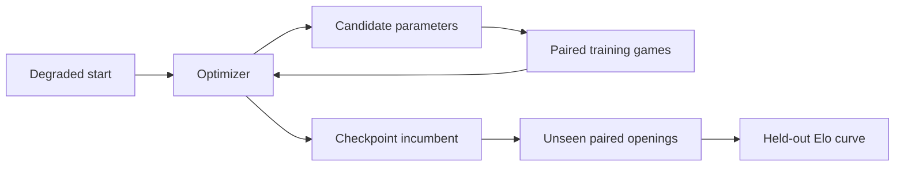

# Tuning chess search from game outcomes

Search tuning is an unusually hostile optimization problem. A parameter vector can be evaluated only by playing
games, one game is a very noisy observation, useful search features may appear only at realistic depth, and the
parameters interact. A tuner can look persuasive internally while recommending a weaker engine.

This directory contains an engine-independent experiment harness and six optimizers. We are comparing them by a
single practical question:

> Starting from deliberately damaged search parameters, how much playing strength can a method recover per game?

This is a first report. The 200-game pilot is complete; the preregistered 1,000-game, three-start experiment and the
logistic-GP follow-up are still running or awaiting held-out validation. Results below are dated 2026-08-18.

## The experiment

We first generate several reproducible parameter vectors that are clearly weaker than Sunfish's defaults. Each
optimizer receives the same:

- 12 search parameters and bounds;
- a common master reference—fixed-opponent games except for SPSA's required symmetric perturbation matches;
- color-swapped opening pairs;
- `3+0.1` time control with the C twin;
- training-game budget; and
- independent validation openings.

The C twin follows `sunfish.py` node for node, making long search-tuning matches practical. `3+0.1` is our current C
surrogate for Python `30+1`; it is long enough to exercise null search, LMR, and the depth-dependent pruning under
study. This calibration remains part of the experimental assumptions rather than a universal conversion factor.



The primary x-axis is the number of training games actually consumed. Optimizer iterations are not comparable:
one SPSA step tests two perturbations, while another method may spend several pairs refining one point. Wall time is
reported separately because model overhead and parallel efficiency still matter operationally.

### Why held-out games are mandatory

Every method can print a number called its current score, but the numbers mean different things. GP methods report
posterior estimates, RBFOpt and CLOP report surrogate optima, and SPSA reports its current iterate. Selecting the
largest estimate also creates winner's-curse bias: the selected point is partly the one that got lucky.

Only `validate.py` results from openings excluded from training belong on the common Elo curve. When every
checkpoint uses the same validation pairs, `plot_recovery.py` can estimate paired Elo gain from the degraded start.

### What “pentanomial” means

One opening is played twice with colors reversed. The candidate's total score is therefore one of

```text
0, 0.5, 1, 1.5, 2
```

rather than two independent binary observations. `pentanomial.py` retains these five outcomes. This captures the
correlation induced by opening difficulty and color and gives better uncertainty estimates than treating every game
as independent.

## Methods

| Directory | Method | Role in the comparison |
| --- | --- | --- |
| [`logistic_gp/`](logistic_gp/) | Logistic Gaussian process | Custom global/local Bayesian search |
| Chess Tuning Tools adapter | Chess Tuning Tools, MES | Chess-specific GP reference |
| RBFOpt adapter | RBFOpt, MSRSM | Non-GP global surrogate |
| SPSA adapter | Fishtest-style SPSA | Dimension-efficient local refinement |
| CLOP adapter | Official CLOP | Chess-specific local quadratic method |
| built into the GP runner | Maximin design | Space-filling non-adaptive control |
| [`texel/`](texel/) | Texel fitting | Static evaluation only; not in the search comparison |

The adapters accept ordinary UCI engines and JSON parameter spaces. Sunfish's parameters and correctness gates are
examples, not optimizer requirements.

## Pilot: one start, 200 training games

The pilot used one degraded start measured at `-151.35 +/- 63.49` Elo versus the fixed baseline. Each checkpoint
recommendation then played 100 fresh color-swapped opening pairs.

![Held-out Elo recovery after 0, 50, 100, and 200 training games][pilot-recovery]

[pilot-recovery]: ../../tuning-results/pilot-start23/all-six.svg

The final pilot checkpoint was:

| Method | Training games | Held-out Elo recovered | Interpretation |
| --- | ---: | ---: | --- |
| Chess Tuning Tools, MES | 200 | `+58.89 +/- 83.26` | Best point estimate; very uncertain |
| SPSA | 200 | `+36.12 +/- 67.87` | Positive-looking local recovery |
| RBFOpt | 194 | `+16.40 +/- 90.23` | Evaluation consumed six fewer games |
| CLOP | 200 | `-12.72 +/- 80.75` | Inconclusive |
| Maximin control | 200 | `-12.72 +/- 100.48` | A lucky 100-game incumbent did not persist |
| Logistic GP | 200 | `-34.90 +/- 86.20` | Failed to show recovery |

Every interval overlaps zero and every pairwise ranking is uncertain. The pilot says which implementations are worth
debugging; it does **not** identify a winning optimizer. The raw and aggregate data are in
[`tuning-results/pilot-start23`](../../tuning-results/pilot-start23/).

## Why the first logistic GP failed

The weak pilot result led to a model and allocation audit. Four problems mattered.

### 1. The initial design was global when the problem was local

The first 24 configurations changed 10-12 of 12 parameters simultaneously and were 3.5-5.6 kernel lengths from the
degraded start. They estimated broad space coverage but gave almost no directional information about how to repair
the engine.

This continued after initialization: 94 of the first 100 pairs and 357 of 369 pairs in a longer run used distinct
configurations. The allocator was behaving much more like space filling than optimization.

### 2. The prior made every unknown corner look like master

The fixed opponent has zero Elo by definition, and the old GP prior assigned zero Elo to every untested parameter
vector. Once measured configurations looked bad, an unseen corner automatically looked better than them. The GP
could not distinguish “unknown” from “as strong as master.”

The replacement design measures one approximately kernel-length step in each direction along every parameter axis.
After that balanced stencil completes, its aggregate score supplies a global intercept. Crucially, the intercept is
then frozen. Re-estimating it from adaptively selected good points would raise the prior again and reintroduce the
same optimism through selection bias.

### 3. Maximizing twelve noisy effects manufactured imaginary candidates

One color-swapped pair per axis is still noisy. A global posterior maximizer can combine the lucky direction from
many axes into a parameter vector that has never been played. This is the optimizer's curse in parameter space.

In a controlled synthetic recovery problem, the start was `-151` Elo and the best point in the finite candidate pool
was `-89` Elo. After 25 noisy axis pairs, unrestricted posterior-mean maximization recommended a median `-449` Elo
point over 100 runs. A one-standard-deviation lower confidence rule stayed near the start (`-146` median), but did
not reliably improve it. This is a diagnostic simulation, not chess Elo.

We therefore tested a small trust region: exploitation could change only one parameter from a configuration already
measured. This removed unplayed multi-parameter recommendations, but it did not remove selection noise. In a second
ten-run synthetic screen after 50 pairs, global posterior-mean selection had median `-347` Elo and the local version
had median `-424` Elo. The simple trust region was not an improvement.

Conservative incumbent selection was more useful. On another ten local runs, choosing the one-standard-deviation
lower confidence bound improved the median recommendation from `-203` to `-168` Elo. After 100 pairs over 20 runs,
however, the corresponding median was still `-176` Elo. This limits catastrophic recommendations but does not yet
recover strength. The next design must allocate repeated evidence or direct parameter duels, rather than merely
constraining where the posterior is maximized.

### 4. The likelihood was too conservative, but this was secondary

The original effective weight treated one color-swapped pair as one Bernoulli-equivalent trial. Empirical pair-score
variance corresponded to roughly 2.5-2.9 independent trials in the inspected data. Five-fold replay improved when
the pair weight was raised and the kernel was made smoother and additive:

| Model on pilot observations | Out-of-fold log loss | Brier score |
| --- | ---: | ---: |
| Original settings | 0.57190 | 0.07777 |
| Pair weight 1 | 0.55505 | 0.07032 |
| Additive kernel, 1.7x length, pair weight 2 | 0.54132 | 0.06466 |

We are testing pair weight 1 as the conservative live setting. A true pentanomial observation model remains a
possible improvement; likelihood calibration alone cannot repair a bad acquisition trajectory.

One suspected problem was ruled out. The 128-point sparse GP differed from an exact GP by only 0.15 Elo RMS over
the live 50-pair candidate set, with correlation 0.99984. Sparse approximation was not causing the failed recovery.

## Logistic-GP follow-up

Three 200-game training trajectories have completed and await common held-out validation:

| Arm | Initial design | Kernel / likelihood | Acquisition change |
| --- | --- | --- | --- |
| Axis | Local axis stencil | Original | Otherwise unchanged |
| V2 | Local axis stencil | Additive, 1.7x length, pair weight 1 | Less explicit exploration |
| V3 | V2 | V2 | Learn a fixed-opponent intercept after the stencil |

A fourth arm measures the played-point trust region described above. Its synthetic result is already negative, but
the live trajectory remains useful for checking whether the simplified model reproduces actual optimizer behavior.
Until validation is complete, training scores and posterior estimates are debugging signals only—not Elo results.

## Larger recovery study

The preregistered study uses three independently degraded starts and 1,000 training games per method and start.
Checkpoint incumbents are extracted at 0, 100, 200, 400, 700, and 1,000 games and validated on a common unseen
opening block.

As of this draft:

- Chess Tuning Tools had consumed 856, 864, and 598 games across the three starts;
- SPSA had consumed 772, 790, and 802 games;
- the three logistic-GP diagnostic arms had each completed 200 games on start 23; and
- common held-out validation and the remaining long optimizer trajectories were pending.

The frozen protocol is in [`protocol.json`](../../tuning-results/recovery-1000/protocol.json), with corrections in
[`protocol-amendment-1.json`](../../tuning-results/recovery-1000/protocol-amendment-1.json). The primary result will
be mean held-out recovery at 1,000 games across starts; normalized area under the recovery curve is secondary.

## A separate parameter screen

Before the optimizer comparison, a 500-game screen tested grouped changes against the pinned engine:

| Group | Held-out result |
| --- | ---: |
| Search parameters | `+27.85 +/- 26.66` Elo |
| Piece values | `+2.08 +/- 26.07` Elo |
| PST scales | `+5.56 +/- 26.46` Elo |
| Piece values plus PST scales | `+8.34 +/- 26.61` Elo |

Only the search bundle looked promising, and even it remained statistically inconclusive. These are candidate
screens, not evidence that any optimizer found the settings. Full options and hashes are recorded in
[`summary.json`](../../tuning-results/classic-allparams-20260818/summary.json).

## Reproducing the pipeline

The reusable workflow is:

1. Use `recovery_starts.py` to generate and screen reproducible degraded starts.
2. Run each adapter with the same engine, space, openings, time control, and game budget.
3. Extract checkpoint parameter vectors with `recommend.py`.
4. Combine every method's recommendations before invoking `validate.py`; it deduplicates identical vectors.
5. Run `plot_recovery.py` to produce raw CSV, aggregate CSV, recovery SVG, and absolute-Elo SVG.

Use `--help` on each script for its complete command line. Training and validation files should record engine,
tables, openings, and configuration hashes. Never feed validation games back into an optimizer.

## Chess Tuning Tools compatibility notes

The pinned Chess Tuning Tools image applies three narrow compatibility fixes: NumPy scalar conversion, a finite
iteration limit that persists its final incumbent, and optimization over the GP's transformed unit cube rather than
raw UCI-option bounds. Without the last fix, current SciPy can collect games but fail to record an optimum.

The fastchess shim writes recovery state to `fastchess-state.json`. Keep the CTT input under another name such as
`tuner.json`, so recovery cannot overwrite the tuner configuration. The image installs the shim as
`cutechess-cli`; `FASTCHESS` points to the real fastchess executable. When `make_config.py` writes
`--start-output`, it also records that file in the configuration, so CTT evaluates the declared default first.

When mounting a host result directory into Docker, use `--user "$(id -u):$(id -g)"`. Otherwise atomic checkpoints
may be created as root-owned mode-600 files and become unreadable to the host-side analysis tools.

## Current conclusions

The defensible conclusions are deliberately modest:

1. Held-out paired games are essential; internal optimizer scores are not a common metric.
2. The pilot is underpowered, but CTT and SPSA earned continued testing.
3. Our first logistic GP spent too many games covering distant configurations and had an optimistic unknown-region
   prior.
4. Kernel calibration and local acquisition are insufficient by themselves. The remaining problem is allocation:
   the tuner needs to revisit uncertain incumbents or compare nearby configurations directly before composing them.
5. No method has yet won the preregistered comparison.

The final article will replace the progress section with three-start held-out learning curves and will compare
recovery per game, wall time, parallel efficiency, and implementation complexity.
